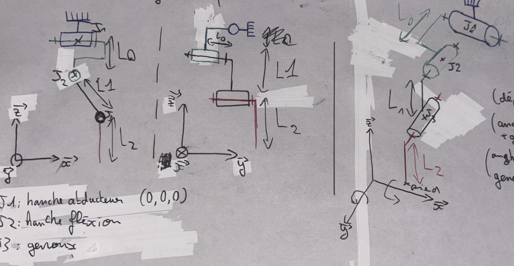

# Foxibot – Leg Kinematics Conventions

## 1. Conventions géométriques

### 1.1 Repère de référence et origine

Le repère de référence de la patte est noté $\mathcal{R}_H$ et est attaché à la hanche.

* **Origine :** centre de rotation de l’articulation $J_1$.
* **Convention utilisée :** convention ROS REP-103.
* Toutes les positions du pied sont exprimées dans le repère $\mathcal{R}_H$.
* La position du pied est notée :

$$
\mathbf{p} =
\begin{pmatrix}
x \
y \
z
\end{pmatrix}
$$

où $x$, $y$ et $z$ sont exprimés en mètres.

### 1.2 Orientation des axes

Les axes du repère $\mathcal{R}_H$ sont orientés comme suit :

* **Axe $X$ :** vers l’avant du robot.
* **Axe $Y$ :** vers la gauche du robot.
* **Axe $Z$ :** vers le haut du robot.

```text
         Z
         ^
         |
         |
         o --------> X
        /
       /
      Y
```

Cette orientation est commune aux quatre pattes. Les éventuelles différences entre les pattes gauche et droite devront être traitées par leurs transformations respectives par rapport au corps du robot, et non en modifiant la convention locale de la patte.

### 1.3 Architecture de la patte

La patte possède trois articulations rotatives :

| Articulation | Désignation                      | Axe de rotation | Angle associé |
| ------------ | -------------------------------- | --------------: | ------------: |
| $J_1$        | Abduction/adduction de la hanche |             $X$ |    $\theta_1$ |
| $J_2$        | Flexion/extension de la hanche   |             $Y$ |    $\theta_2$ |
| $J_3$        | Flexion/extension du genou       |             $Y$ |    $\theta_3$ |

L’articulation $J_1$ permet de faire tourner le plan de la jambe autour de l’axe $X$.

Les articulations $J_2$ et $J_3$ forment ensuite une chaîne cinématique plane évoluant initialement dans le plan $XZ$ lorsque :

$$
\theta_1 = 0
$$

**NB**: cette condition n'est vraie que dans le plan $XZ$, sinon $\theta_1$ varie entre $(-\pi,\pi]$ dans les limites mécaniques de mobilité.

### 1.4 Dimensions géométriques

Les longueurs utilisées dans le modèle cinématique sont :

* $L_0$ : distance entre le centre de rotation de $J_1$ et le centre de rotation de $J_2$ ;
* $L_1$ : longueur du fémur, entre $J_2$ et $J_3$ ;
* $L_2$ : longueur du tibia, entre $J_3$ et le pied.

| Paramètre | Description                 |       Valeur |
| --------- | --------------------------- | -----------: |
| $L_0$     | Offset entre $J_1$ et $J_2$ | À déterminer |
| $L_1$     | Longueur du fémur           | À déterminer |
| $L_2$     | Longueur du tibia           | À déterminer |

Toutes les longueurs sont exprimées en mètres.

> [!NOTE]
> Dans le code, $L_0$ correspond au champ `hip_offset`, $L_1$ à `femur_length` et $L_2$ à `tibia_length`.

### 1.5 Position zéro

La position articulaire zéro est définie par :

$$
\theta_1 = 0,\qquad
\theta_2 = 0,\qquad
\theta_3 = 0
$$

Dans cette configuration :

* le plan de la jambe est confondu avec le plan $XZ$ ;
* le fémur et le tibia sont alignés ;
* la patte est entièrement tendue vers le bas ;
* le pied est situé sous la hanche.

La position exacte du pied dépend de la convention retenue pour l’offset $L_0$.

Elle devra être écrite explicitement après validation du schéma cinématique :

$$
\mathbf{p}_0 =
\begin{pmatrix}
0 \
L_0 \
-(L_1+L_2)
\end{pmatrix}
$$

### 1.6 Sens positifs des articulations

Le sens positif de chaque articulation est défini à l’aide de la règle de la main droite autour de son axe de rotation.

#### Articulation $J_1$

* Axe de rotation : $X$.
* Angle associé : $\theta_1$.
* Sens positif : règle de la main droite autour de $+X$.
* Conséquence physique : 
    * $\theta_1>0$ : la patte tourne vers le sol
    * $\theta_1<0$ : la patte tourne vers le ciel

#### Articulation $J_2$

* Axe de rotation : $Y$.
* Angle associé : $\theta_2$.
* Sens positif : règle de la main droite autour de $+Y$.
* Convention physique retenue : un angle positif déplace le fémur vers l’avant du robot, dans la direction $+X$.

#### Articulation $J_3$

* Axe de rotation : $Y$ local de l’articulation du genou.
* Angle associé : $\theta_3$.
* Sens positif : règle de la main droite autour de cet axe.
* Convention physique retenue : à préciser selon le sens de flexion choisi pour obtenir la configuration « genou arrière ».

> [!WARNING]
> Les sens positifs de $J_1$ et $J_3$ doivent être validés graphiquement sur les schémas avant l’implémentation. Une erreur de signe dans cette section se propagerait dans la FK, l’IK, l’URDF et la calibration des servomoteurs.

### 1.7 Poses de référence

Trois poses sont définies afin de vérifier les conventions et les équations cinématiques.

Ces poses seront utilisées comme cas de test pour :

* la cinématique directe ;
* la cinématique inverse ;
* les tests aller-retour FK → IK → FK.

#### Pose de référence A — Position zéro

Angles :

$$
\theta_1 = 0,\qquad
\theta_2 = 0,\qquad
\theta_3 = 0
$$

Position attendue :

$$
\mathbf{p}_A =
\begin{pmatrix}
0 \
L_0 \
-(L_1+L_2)
\end{pmatrix}
$$

#### Pose de référence B — Flexion de hanche à 90°

Angles :

$$
\theta_1 = 0,\qquad
\theta_2 = \frac{\pi}{4},\qquad
\theta_3 = \frac{\pi}{2},\qquad
$$

Position attendue :

$$
\mathbf{p}_B =
\begin{pmatrix}
\frac{L_1+L2}{\sqrt{2}}\
L_0 \
\frac{L_1-L2}{\sqrt{2}}
\end{pmatrix}
$$

#### Pose de référence C — Pose quelconque

Angles :

$$
\theta_1 = \frac{\pi}{4},\qquad
\theta_2 = 0,\qquad
\theta_3 = \frac{\pi}{2},\qquad
$$

Position attendue :

$$
\mathbf{p}_C =
\begin{pmatrix}
0\
\frac{L_0+L_1}{\sqrt{2}} \
\frac{L_0-L1}{\sqrt{2}}
\end{pmatrix}
$$

La troisième pose doit comporter des angles non nuls sur les trois articulations afin de vérifier le comportement complet de la cinématique 3D.

### 1.8 Limites articulaires

Les limites articulaires sont définies dans le modèle de la patte :

| Articulation | Angle minimal | Angle maximal |
| ------------ | ------------: | ------------: |
| $J_1$        |  À déterminer |  À déterminer |
| $J_2$        |  À déterminer |  À déterminer |
| $J_3$        |  À déterminer |  À déterminer |

Les angles sont exprimés en radians dans le code.

La cinématique directe calcule une position sans modifier ni limiter les angles fournis.

La cinématique inverse calcule une solution géométrique. La validité de cette solution vis-à-vis des limites articulaires est vérifiée séparément par la fonction `isWithinLimits()`.

### 1.9 Convention de résolution de la cinématique inverse

Pour une même position du pied, plusieurs configurations articulaires peuvent être possibles.

Dans la première version de Foxibot, une seule branche de solution est retenue :

* configuration dite **genou vers l’arrière** ;
* l’autre solution géométrique n’est pas retournée ;
* le choix du signe utilisé dans le calcul de $\theta_3$ devra être indiqué dans la partie consacrée à l’IK.

La fonction de cinématique inverse retourne un `std::optional<JointAngles>`.

Elle retourne `std::nullopt` lorsque la cible est géométriquement inatteignable, notamment lorsque la distance entre $J_2$ et le pied est :

$$
r > L_1 + L_2
$$

ou :

$$
r < \left|L_1 - L_2\right|
$$

Une cible est également géométriquement inatteignable lorsque sa distance à l’axe de rotation de la hanche est inférieure à l’offset $L_0$.

Dans le plan $(YZ)$, cette distance vaut :

$$
\rho = \sqrt{y^2+z^2}
$$

La condition d’existence d’une solution pour $\theta_1$ est donc :

$$
\rho \ge |L_0|
$$

soit, de manière équivalente :

$$
y^2+z^2 \ge L_0^2
$$

Si cette condition n’est pas respectée, aucun plan de jambe obtenu par rotation autour de $J_1$ ne peut contenir la cible. La cinématique inverse retourne alors `std::nullopt`.

Les frontières exactes sont considérées comme atteignables :

$$
r = L_1 + L_2
$$

correspond à une jambe entièrement tendue, tandis que :

$$
r = \left|L_1 - L_2\right|
$$

correspond à une jambe entièrement repliée.


> [!NOTE]
> Une cible atteignable géométriquement mais produisant des angles hors des limites articulaires ne provoque pas nécessairement un `std::nullopt`. La portée géométrique et les limites mécaniques constituent deux vérifications distinctes.


## 2. Schémas cinématiques

Les trois représentations suivantes décrivent le modèle cinématique utilisé pour établir les équations de la cinématique directe et inverse.

| Vue 2D (XZ) | Vue 2D (YZ) | Vue 3D |
|:-----------:|:-----------:|:------:|
| Schéma de la cinématique plane utilisée pour les calculs de $\theta_2$ et $\theta_3$. | Projection utilisée pour le calcul de $\theta_1$ et la prise en compte de l'offset $L_0$. | Représentation complète de la patte dans son repère de référence. |

<p align="center">
  
</p>

**Figure 1 —** Représentations cinématiques de la patte Foxibot : vue dans le plan $XZ$, vue dans le plan $YZ$ et représentation 3D.
## 3. Forward Kinematics (FK)

### 3.1 Variables

### 3.2 Démonstration

### 3.3 Résultat final

### 3.4 Vérification

## 4. Inverse Kinematics (IK)

### 4.1 Variables

### 4.2 Calcul de θ1

### 4.3 Calcul de θ3

### 4.4 Calcul de θ2

### 4.5 Cas particuliers

### 4.6 Vérification